# Marketo Mobile SDK for Android 0.6.4

The Marketo Mobile SDK allows integration with Marketo Mobile Engagement (MME).  

# Change Log

v0.6.4
- Exposed method [MarketoSDK reportAll] to immediately send events

v0.6.3
- Bug fixes related to inapp
- added display frequency 'once'

v0.6.0
- InApp Notifications

v0.5.3
- Fixed bug that stop push notification when app was closed

v0.5.2
- Removed depricated android methods to allow building with Proguard

v0.5.1
- Fixed intent.getAction condition

v0.5.0
- New secure access feature
- New app type selection
- Android notificaiton config large icon

# Issues

If you encounter issues using or integrating this plugin, please file a support ticket at support.marketo.com

# Marketo Android SDK Installation Guide 

## Prerequisites 
1.  Register an application in Marketo Admin portal, get your application secret key and munchkin id.
2.  Configure Android Push access [learn here](http://docs.marketo.com/display/public/DOCS/Configure+Mobile+App+Android+Push+Access)
3.  Download [Marketo SDK for Android](https://github.com/Marketo/android-sdk/archive/master.zip). 

## Android SDK Setup
1. Open your project in android Studio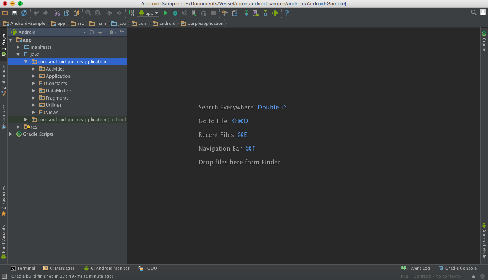
2. Right click on your project and select #Open Module Settings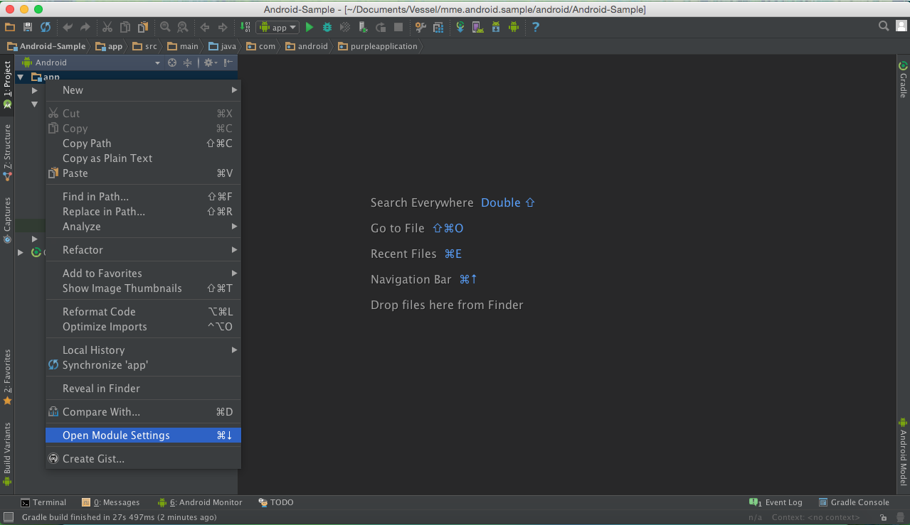
3. Click on the '+' button on the top Left Corner 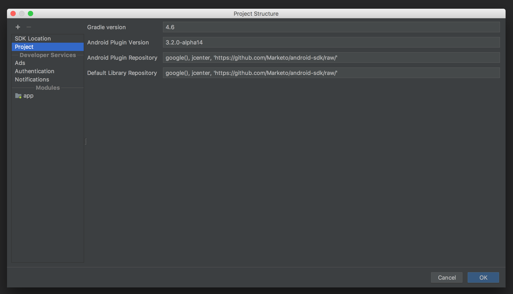
4. Select 'Import .JAR/.AAR package' and click 'Next'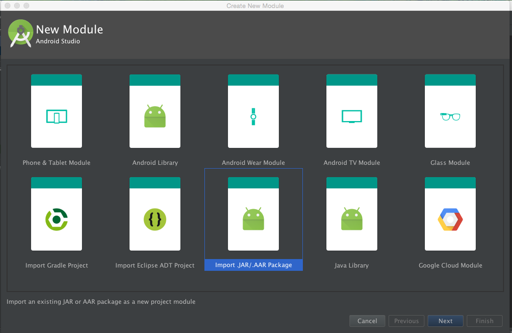
5. Now clik on the '...' button and select the location of the .aar file from Marketo Android SDK 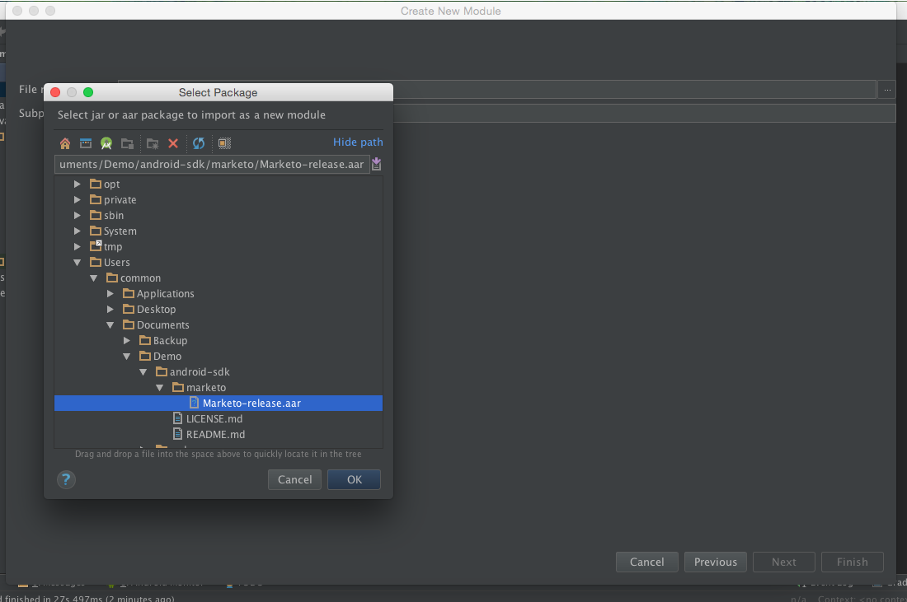
6. You can change the name of the sub project and select finish and select ok 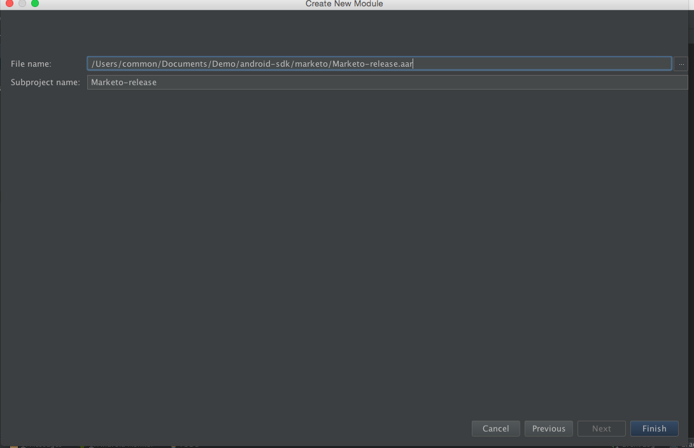
7. Right click on your project and select #Open Module Settings#
8. Select your project name in the Modules and click on the dependancies tab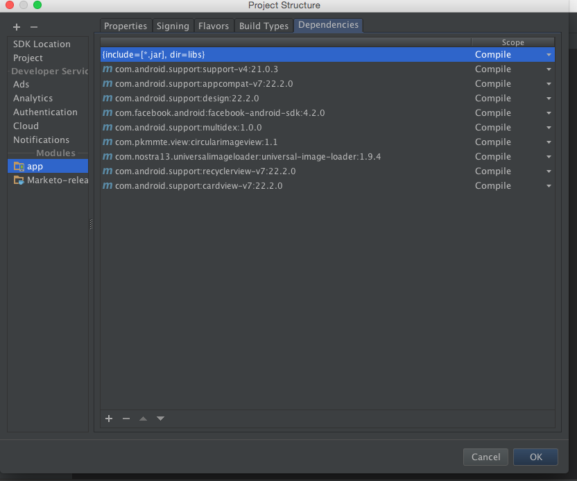
9. Click on the '+' button (at the bottom on Mac and at the left right top corner on windows) and select Module dependency 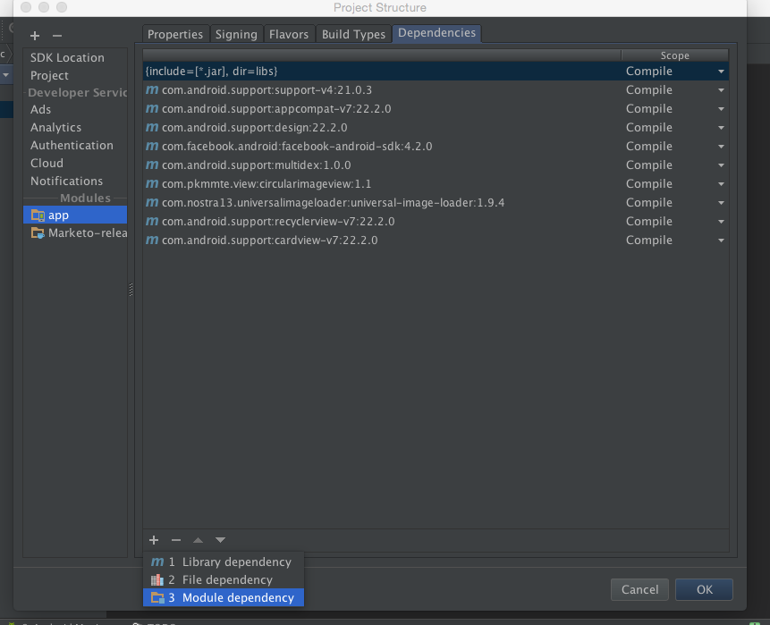
10. select the name which you gave in step 7 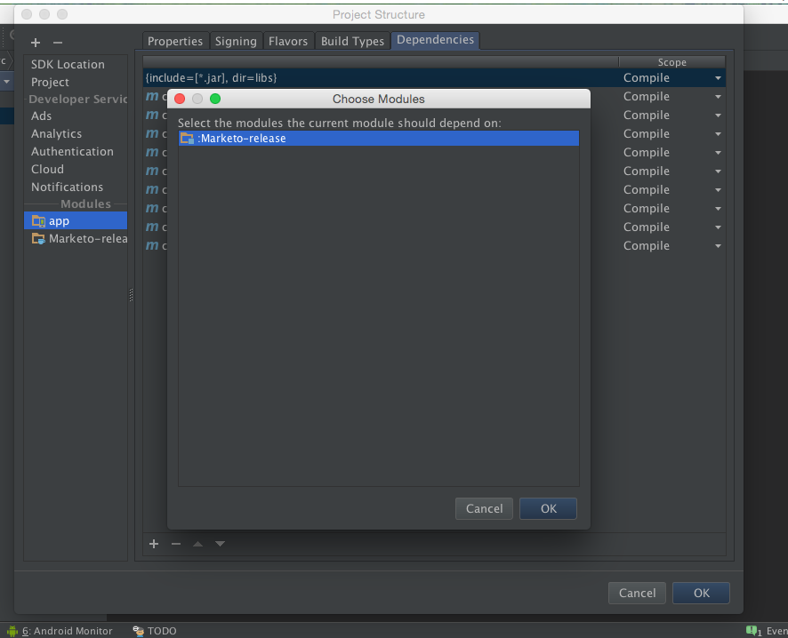
11. select ok and let the gradle sync the project and resolve the dependancy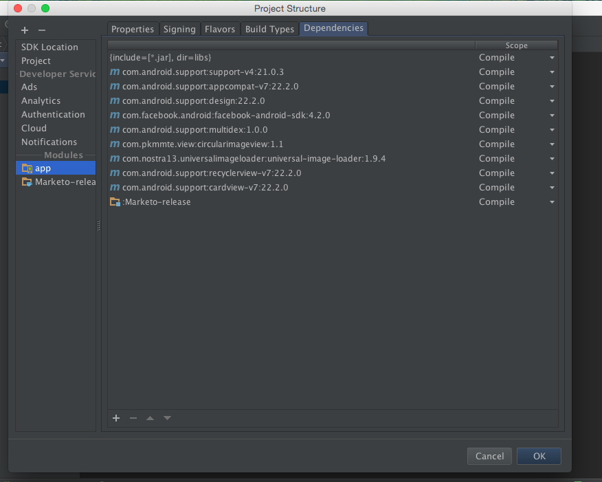
12. once gradle is complete it will show you the following info in Gradle Console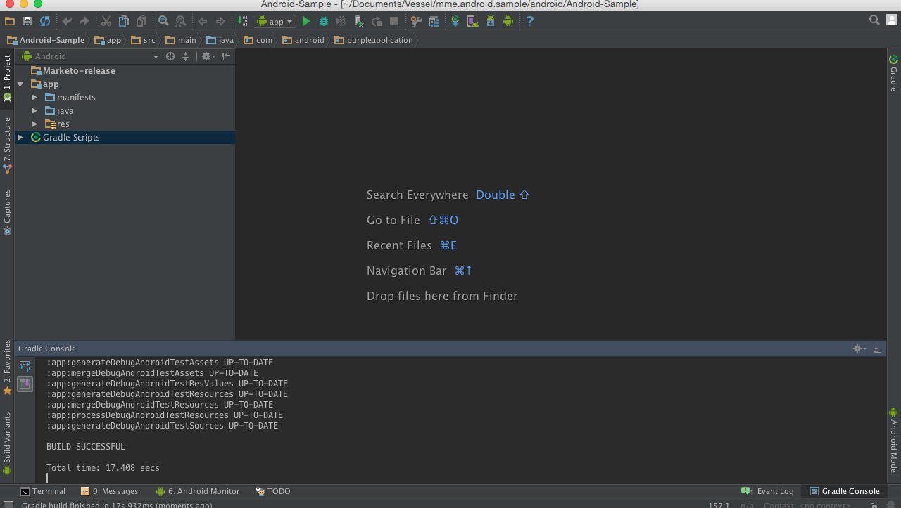

## Configure Permissions

- Add following permission inside application tag.

 Open AndroidManifest.xml and add following permissions. Your app must request the “INTERNET” and “ACCESS_NETWORK_STATE” permissions. If your app already requests these permissions, then skip this step.
```java
    <uses‐permission android:name="android.permission.INTERNET"/>
    <uses‐permission android:name="android.permission.ACCESS_NETWORK_STATE"/>
    <uses-permission android:name="android.permission.ACCESS_COARSE_LOCATION"/>
   
   <!‐‐Following permissions are required for push notification.‐‐>
    <uses-permission android:name="android.permission.GET_ACCOUNTS"/>
    <!‐‐Keeps the processor from sleeping when a message is received.‐‐>
    <uses-permission android:name="android.permission.WAKE_LOCK"/>
    <permission android:name="<PACKAGE_NAME>.permission.C2D_MESSAGE" android:protectionLevel="signature" />
    <uses-permission android:name="<PACKAGE_NAME>.permission.C2D_MESSAGE" />
    <!-- This app has permission to register and receive data message. -->
    <uses-permission android:name="com.google.android.c2dm.permission.RECEIVE" />
```

### Android Test Devices

Add Marketo Activity in manifest file inside application tag.
```java
    <activity android:name="com.marketo.MarketoActivity"  android:configChanges="orientation|screenSize" >
        <intent-filter android:label="MarketoActivity" >
            <action  android:name="android.intent.action.VIEW"/>
            <category  android:name="android.intent.category.DEFAULT"/>
            <category  android:name="android.intent.category.BROWSABLE"/>
            <data android:host="add_test_device" android:scheme="mkto" />
        </intent-filter>
    </activity>
```

### Register Marketo Push Service

To receive push notifications from Marketo, you need to add the Marketo Service and Broadcast Receiver to your AndroidManifest.xml.  Add before the closing of application tag.
```java
    <receiver android:name="com.marketo.MarketoBroadcastReceiver" android:permission="com.google.android.c2dm.permission.SEND">
        <intent-filter>
            <!‐‐Receives the actual messages.‐‐>
            <action android:name="com.google.android.c2dm.intent.RECEIVE"/>
    
            <!‐‐Register to enable push notification‐‐>
            <action android:name="com.google.android.c2dm.intent.REGISTRATION"/>
    
            <!‐‐‐Replace YOUR_PACKAGE_NAME with your own package name‐‐>
            <category android:name="YOUR_PACKAGE_NAME"/>
        </intent-filter>
    </receiver>
    
    <!‐‐Marketo service to handle push registration and notification‐‐>
    <service android:name="com.marketo.MarketoIntentService"/>
```

## SDK Initialization

- Open your Application or Activity class in your app and import the Marketo SDK into your Activity before setContentView or in Application Context.

 ```java
    // Initialize Marketo
    Marketo marketoSdk = Marketo.getInstance(getApplicationContext());
    marketoSdk.initializeSDK("munchkinAccountId","secretKey");
```
- Configure activities.  Add Marketo.onStart, Marketo.onStop in all or in base activity as shown below.

```java
    @Override
        protected void onStop() {
        Marketo.onStop(this);
        super.onStop();
    }
    
    @Override
        protected void onStart() {
        Marketo.onStart(this);
        super.onStart();
    }
```
## Initialize Marketo Push

After saving the configuration above, you must initialize Marketo Push Notification. Create or open your Application class and copy/paste the code below. You can get your sender ID from the Google Developer Portal.

```java
    Marketo marketoSdk = Marketo.getInstance(getApplicationContext());
    marketoSdk.initializeSDK("munchkinAccountId","secretKey");
    
    // Enable push notification here.
    marketoSdk.initializeMarketoPush(SENDER_ID);
```
If you do not have a SENDER_ID, then enable Google Cloud Messaging Service by completing the steps detailed in [this tutorial](https://developer.android.com/google/gcm/client.html).

###Set Notification Icon (Optional)

To configure a custom notification icon the following method should be called.
```java

    MarketoConfig.Notification config = new MarketoConfig.Notification();
    // Optional bitmap for honeycomb and above
    config.setNotificationLargeIcon(bitmap);
    
    // Required icon Resource ID
    config.setNotificationSmallIcon(R.id.notification_small_icon); 
    
    // Set the configuration 
    Marketo.getInstance(context).setNotificationConfig(config); 
    
    // Get the configuration set 
    Marketo.getInstance(context).getNotificationConfig(config);
  
```

###How to Create User Profile on Android

- Create User Profile

You can create rich profiles by sending user fields as shown below.
```java
    MarketoLead profile = new MarketoLead();
    
    // Get user profile from network and populate
    try {
        profile.setEmail("htcone3@gmail.com");
        profile.setFirstName("Mike");
        profile.setLastName("Gray");
        profile.setFacebookId("facebookid");
        profile.setAddress("1234 King Fish Blvd");
    }
    catch (MktoException e) {
        e.printStackTrace();
    }
```
- Add more Standard Fields.

```java
    // Add other custom fields
    profile.setCustomField("mobilePhone", "123.456.7890");
    profile.setCustomField("numberOfEmployees", "10");
    profile.setCustomField("phone", "123.456.7890");
    profile.setCustomField("rating", "R");
    profile.setCustomField("facebookDisplayName", "mini");
    profile.setCustomField("facebookReach", "10");
    profile.setCustomField("facebookReferredEnrollments", "100");
    profile.setCustomField("facebookReferredVisits", "9998");
    profile.setCustomField("lastReferredEnrollment", "03/01/2015");
    profile.setCustomField("lastReferredVisit", "03/01/2015");
    profile.setCustomField("linkedInDisplayName", "Android");
```

- Report User Profile
```java
    MarketoLead profile = new MarketoLead();
    
    // This method will update user profile
    marketoSdk.associateLead(profile);
```

###You can track user interaction by sending custom actions.

- Send custom action.
```java
    Marketo.reportAction("Login", null);
```
- Add custom action meta data.
```java
    MarketoActionMetaData meta = new MarketoActionMetaData();
    meta.setActionType("Shopping");
    meta.setActionDetails("RedShirt");
    meta.setActionLength("20");
    meta.setActionMetric("30");
    
    Marketo.reportAction("Bought Shirt", meta);
```

### ProGuard Configuration (Optional)
If you are using ProGuard for your app, then add the following lines in your proguard.cfg file. The file will be located within your project folder. Adding this code will exclude the Marketo SDK from the obfuscation process.

```java
    -dontwarn com.marketo.*
    -dontnote com.marketo.*
    -keep class com.marketo.**{ *; }
```

###Advanced Security Access Mode

This setup must be implemented before the Secure Access mode has been enable via the Marketo Admin -> Mobile Apps & Devices page. The following further steps describe the process required to complete the security validation process:

Secure Access mode requires implementing the signature algorithm on the customer server-side that will provide an endpoint to retrieve the access key, calculated signature, expiry timestamp, and email. This algorithm requires the user access key, access secret, email, timestamp, and device id to preform the calculation. The customer is responsible for setting up endpoint, implementing the algorithm to preform signature calculations, and also keep expiration timestamp fresh.[Link Here](http://developers.marketo.com/documentation/mobile/advanced-security-access-mode/)

The Marketo SDK exposes new methods to set and remove the security signature. There is also a utility method to retrieve the device ID. The device ID should be passed along with the email, upon login, to the customer server for use in calculating the security signature. The SDK should the hit new endpoint, pointing to algorithm listed above, to retrieve the necessary fields to instantiate the signature object. Setting this signature in the SDK is a necessary step if the Security Access Mode has been enabled in Marketo Mobile Admin.

```java
      Marketo sdk = Marketo.getInstance(getApplicationContext());
      
      // set signature
      MarketoConfig.SecureMode secureMode = new MarketoConfig.SecureMode();
      secureMode.setAccessKey(<ACCESS_KEY>);
      secureMode.setEmail(<EMAIL_ADDRESS>);
      secureMode.setSignature(<SIGNATURE_TOKEN>);
      secureMode.setTimestamp(<EXPIRY_DATE>);
      if (secureMode.isValid()) {
        sdk.setSecureSignature(secureMode);
      }
      
      // remove signature
      sdk.removeSecureSignature();
      
      // get device id
      sdk.getDeviceId();
```
